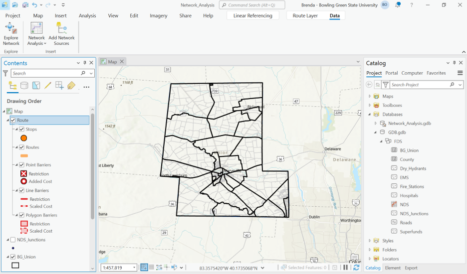
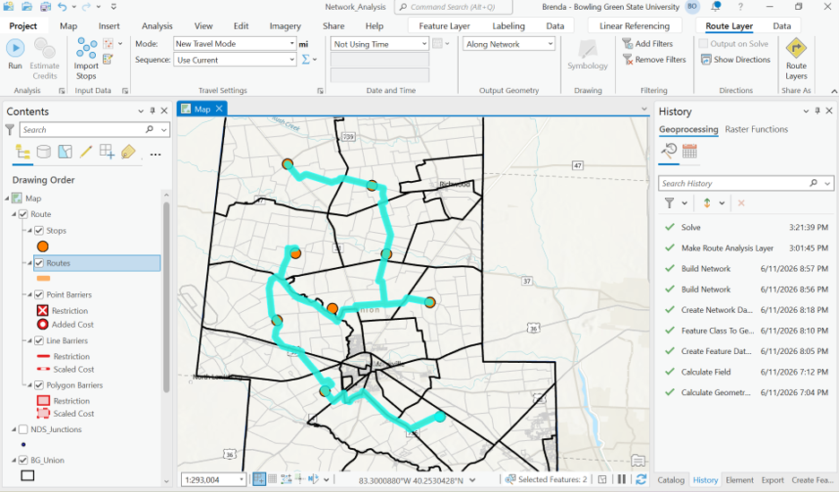
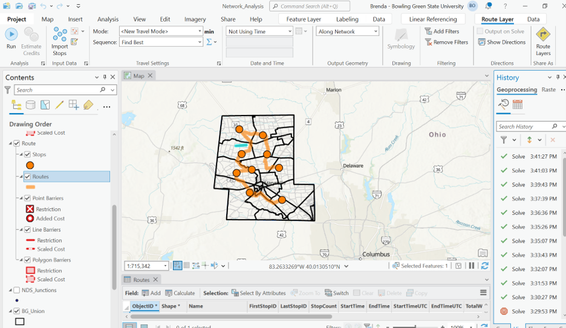
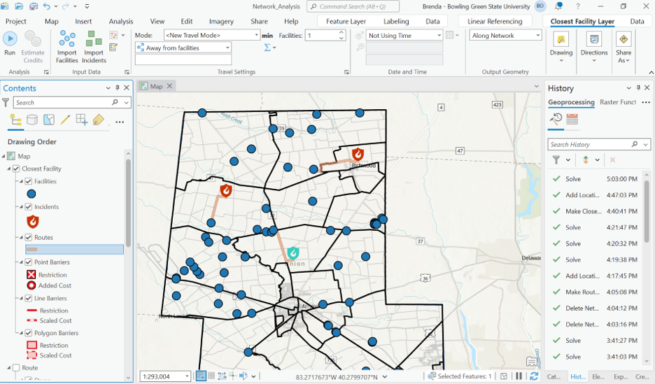
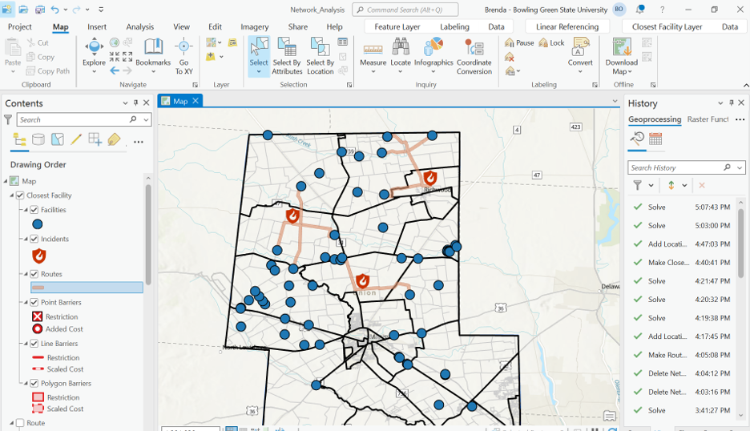

# Network Analysis for Emergency Response Using ArcGIS Pro

## Project Overview

This project demonstrates the use of ArcGIS Pro Network Analyst to support emergency response planning and routing analysis.

The project focuses on building a transportation network dataset, determining optimal routes, evaluating the impact of barriers, and identifying the closest emergency facilities to incident locations. These workflows are commonly used in emergency management, public safety, transportation planning, utility operations, and logistics.

---

## Objectives

The objectives of this project were to:

1. Build and configure a transportation network dataset.
2. Perform shortest path routing analysis.
3. Evaluate the impact of barriers on route selection.
4. Identify the closest emergency facility to an incident location.
5. Determine multiple closest facilities for improved emergency response planning.

---

## Software Used

- ArcGIS Pro
- ArcGIS Network Analyst Extension

---

## Data Used

- Road network
- Emergency facility locations
- Incident locations
- Network dataset

---

## Methodology

## 1. Network Dataset Creation

A transportation network dataset was created using the road network. The network dataset was configured with impedance attributes representing distance in miles and travel time in minutes. These impedance attributes allow the network solver to identify the most efficient routes based on either shortest distance or fastest travel time.

---

## 2. Shortest Route Analysis

A route analysis layer was created to identify the shortest path between selected locations. The analysis used the route solver to determine the optimal path based on the selected impedance attribute.

### Results

- Successfully identified the optimal route.
- Demonstrated how impedance values influence route selection.
- Showed that route optimization can be based on distance or travel time.

---

## 3. Route Analysis with Barrier

A barrier was introduced into the network to simulate a road closure, obstruction, or inaccessible road segment. The route was recalculated to identify an alternative path around the barrier.

### Results

- The network solver successfully avoided blocked road segments.
- Alternative routes were generated automatically.
- The analysis demonstrated real-world emergency response and transportation planning scenarios.

---

## 4. Single Closest Facility Analysis

A Closest Facility analysis was performed to identify the nearest emergency facility to a fire incident. This type of analysis supports emergency dispatch by determining which facility can respond most efficiently.

### Results

- Identified the nearest available emergency facility.
- Calculated the optimal travel route from the facility to the incident.
- Demonstrated how GIS can support emergency response dispatch decisions.

---

## 5. Multiple Closest Facilities Analysis

The Closest Facility analysis was expanded to evaluate multiple facilities serving multiple incidents. This helps determine efficient facility assignments and improves emergency response coverage.

### Results

- Determined efficient facility-to-incident assignments.
- Improved understanding of emergency response coverage.
- Demonstrated network-based resource allocation.

---

## Applications

This workflow can be applied to:

- Fire station dispatch
- Emergency medical response
- Police response planning
- Utility service routing
- Transportation planning
- Logistics and delivery optimization

---

## Skills Demonstrated

- ArcGIS Pro
- ArcGIS Network Analyst
- Network dataset creation
- Route analysis
- Closest Facility analysis
- Barrier analysis
- Spatial decision support
- Emergency response planning
- GIS cartography

---

## Key Takeaways

This project demonstrates how GIS network analysis can support emergency response planning by identifying efficient routes, evaluating network disruptions, and assigning the most appropriate facilities to incidents. ArcGIS Network Analyst provides powerful tools for improving operational efficiency and supporting data-driven decision-making in public safety, transportation, utilities, and logistics.
