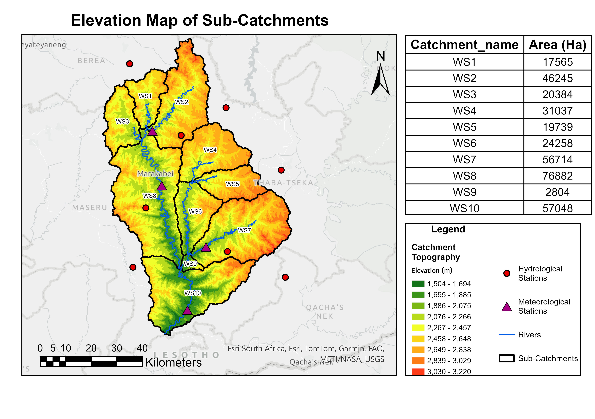

# Watershed Elevation and Sub-Catchment Analysis

## Overview

This project demonstrates a complete watershed delineation and terrain analysis workflow developed in **ArcGIS Pro**. Using a Digital Elevation Model (DEM), the watershed was delineated into ten sub-catchments to support hydrological assessment, environmental monitoring, and water resource management.

The analysis integrates elevation data, river networks, hydrological stations, and meteorological stations to visualize watershed characteristics and support spatial decision-making.

---

## 🗺️ Project Output

### Watershed Elevation and Sub-Catchment Map

This map displays the delineated watershed, sub-catchment boundaries, elevation distribution, river network, hydrological stations, and meteorological stations.



*Figure 1. Watershed elevation map showing sub-catchments, river network, hydrological stations, and meteorological stations.*

---
## Project Objectives

- Delineate watershed and sub-catchment boundaries from elevation data.
- Analyze terrain variation across the watershed.
- Extract and visualize drainage networks.
- Map hydrological and meteorological monitoring stations.
- Produce cartographic outputs for environmental planning and water resource management.

---

## Data Used

### Input Data

- Digital Elevation Model (DEM)
- Watershed boundary data
- River network data
- Hydrological station locations
- Meteorological station locations

### Derived Products

- Flow Direction Raster
- Flow Accumulation Raster
- Stream Network
- Watershed Boundaries
- Sub-Catchment Boundaries
- Elevation Classification Map

---

## Software and Tools

- ArcGIS Pro
- ArcGIS Spatial Analyst
- ArcGIS Hydrology Toolset
- ArcGIS Cartography Tools

---

## Methodology

### 1. DEM Processing

The DEM was preprocessed to remove sinks and ensure hydrologic consistency.

### 2. Hydrological Analysis

Hydrological tools were applied to:

- Generate flow direction
- Calculate flow accumulation
- Extract stream networks
- Define watershed outlets

### 3. Watershed Delineation

Watershed and sub-catchment boundaries were delineated from the generated drainage network and outlet locations.

### 4. Terrain Analysis

Elevation values were classified into multiple ranges to visualize topographic variation throughout the watershed.

### 5. Cartographic Design

The final map layout was created using:

- Elevation symbology
- River network overlays
- Sub-catchment boundaries
- Hydrological station symbols
- Meteorological station symbols
- Scale bar, north arrow, and legend

---

## Key Results

- Delineated **10 sub-catchments (WS1–WS10)**.
- Mapped elevation ranging from approximately **1,504 m to 3,220 m**.
- Visualized watershed drainage patterns and river connectivity.
- Integrated hydrological and meteorological monitoring stations.
- Produced a professional cartographic map for hydrological analysis and decision support.

### Sub-Catchment Areas

| Sub-Catchment | Area (Ha) |
|--------------|----------:|
| WS1 | 17,565 |
| WS2 | 46,245 |
| WS3 | 20,384 |
| WS4 | 31,037 |
| WS5 | 19,739 |
| WS6 | 24,258 |
| WS7 | 56,714 |
| WS8 | 76,882 |
| WS9 | 2,804 |
| WS10 | 57,048 |

---

## GIS Skills Demonstrated

- Watershed Delineation
- Hydrological Modeling
- DEM Processing
- Terrain Analysis
- Spatial Analysis
- Geoprocessing
- Cartographic Design
- Environmental Mapping
- Data Visualization
- ArcGIS Pro Workflow Development

---

## Repository Structure

```text
ArcGIS_Projects/
│
├── README.md
│
└── watershed_projects/
    ├── watershed_map1.jpg
    └── watershed_map1.pdf
```

---

## Applications

This workflow can support:

- Watershed Management
- Flood Risk Assessment
- Water Resource Planning
- Environmental Monitoring
- Hydrological Research
- Sustainable Land Management

---

## Author

**Brenda Ongera**

M.S. Applied Geospatial Science | Bowling Green State University

### Research Interests

- GIS and Spatial Analysis
- Remote Sensing
- Environmental Monitoring
- Landscape Ecology
- Hydrology
- Land Use and Land Cover Change

---

## License

This project is licensed under the MIT License.
